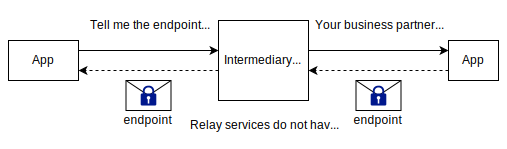

<div align="right">
    <a href="https://github.com/mill6-plat6aux/harmony">
        <picture>
            <source media="(prefers-color-scheme: dark)" srcset="github-mark-white.svg"/>
            
        </picture>
    </a>
</div>

<div align="center">
    <div>
        <picture>
            <source media="(prefers-color-scheme: dark)" srcset="title-w.svg"/>
            
        </picture>
    </div>
    Intermediary Service for Pathfinder Applications
</div>

version 0.9.0

[JA](https://mill6-plat6aux.github.io/harmony/architecture/architecture_ja.html)

## 1. Issues

The movement to calculate a company's greenhouse gas emissions and disclose them to stakeholders is gaining momentum on a global scale. According to the [GHG Protocol](https://ghgprotocol.org), companies are required to calculate their greenhouse gas emissions by dividing them into Scope 1 (direct emissions of greenhouse gases), Scope 2 (indirect emissions associated with the generation of electricity, heat/steam), and Scope 3 (indirect emissions other than Scope 2). However, most companies currently only calculate Scope 1 or Scope 2, or calculate Scope 3 approximately by using so-called "secondary data." This situation is ultimately due to the fact that the calculation of Scope 3 corresponds to the Scope 1 of other companies. In other words, it is generally difficult to know the detailed emissions of other companies, even if they are customers. Therefore, [WBCSD/PACT](https://www.carbon-transparency.org) has defined a data model that avoids infringing on corporate confidentiality as much as possible by limiting the content to grasping greenhouse gas emissions, and has released [Technical Specifications for PCF Data Exchange](https://wbcsd.github.io/tr/data-exchange-protocol/) (hereinafter referred to as Tech Spec), which defines a means to access greenhouse gases managed by each company as an API (Application Programming Interface). The aim is that by using this, companies will be able to provide their calculated emissions to their customers, thereby enabling each company to refine their Scope 3.

Tech Spec is a so-called REST API, and is intended to provide a company's greenhouse gas emissions via the Internet using a web server that implements this. Building such a system will likely be the first challenge for companies, but in recent years, many web applications (SaaS) have been launched that calculate a company's greenhouse gas emissions from its activity data and store the results in a database. Furthermore, many of these applications have implemented Tech Spec to enable the company to provide its information to other companies (see [PACT Conformant Solutions](https://www.carbon-transparency.org/network)). By using such applications, companies are now able to carry out the aforementioned Scope 3 refinement in practice.

When connecting to an external application via the Internet, an endpoint (a group of URLs) that represents the connection destination and authentication information (such as a user ID and password) are required. For example, if a product is composed of 10 parts, and each part is manufactured by another company, 10 pairs of endpoints and authentication information are required. These are generally stored securely in the application's storage, and are read and used to establish communication whenever an access occurs.

When applications that implement Tech Spec are widely introduced to companies, problems will first arise in system operation. This is due to the complexity of managing the endpoints and authentication information mentioned above. Some advanced industrial products have more than tens of thousands of parts, and many companies have tens of thousands of such products. In other words, it becomes necessary to manage a huge number of pairs of endpoints and authentication information. This cannot be left to the end user, so the application vendor will have to bear the burden, but the burden will be enormous, and it will ultimately be reflected in the operating costs of the application and become a burden for the user company.

There are also operational issues. As greenhouse gas emissions become more precise, it will be possible to accurately measure the effects of improvements to one's own products aimed at reducing emissions. However, generally speaking, one can only grasp the emissions from one's own customers (Tier 1), and it is not easy to grasp the emissions from any other companies upstream. It is fine if there is room for improvement in emissions (hot spots) in one's own products or in the parts or raw materials delivered by customers, but if they are upstream, there is no way to do anything. For example, when it comes to products with complex structures such as industrial products, the hot spots may not be in the customers' companies, but in the refining process of raw materials far upstream. Therefore, the next step is to understand the breakdown of emissions from a certain product. In addition, European battery regulations require that the components of a product be traced back to the raw materials and their origins be made clear. In this way, the current situation is that the demands for the refinement of greenhouse gas emissions have already become more sophisticated, exceeding the scope covered by Tech Spec.


## 2. Solution

### 2.1. Improved scalability

When a Web application connects to another Web application via the Tech Spec API, at least the endpoints for [Action Authenticate](https://wbcsd.github.io/tr/data-exchange-protocol/#api-action-auth) (authentication) and [Action ListFootprints](https://wbcsd.github.io/tr/data-exchange-protocol/#api-action-list)/[GetFootprint](https://wbcsd.github.io/tr/data-exchange-protocol/#api-action-get) (product footprint acquisition) are required, as well as authentication information consisting of a user ID and password (Tech Spec ver2 also requires the endpoint for [Action Events](https://wbcsd.github.io/tr/data-exchange-protocol/#api-action-events)). Since it would be difficult for end users to keep track of this information, it would generally be stored securely in the web application's storage.

In practice, end users have contracts with business partners regarding data reference, system personnel exchange information about each other's applications, and information can only be obtained after each party has changed the application settings. As mentioned above, highly complex products can have tens of thousands of parts, so if we think about it simply, this process would occur tens of thousands of times. This is not a very realistic situation.

Therefore, a neutral web server (intermediary service) is prepared separately from the application to mediate the exchange of authentication information with the application endpoint. This makes it possible to efficiently identify the data holder's application from limited information such as the target company identifier, product identifier, and product footprint identifier, and distribute the data with the consent of the parties involved.



It should be noted here that the endpoints and authentication information, which are the most important data for solution vendors, are not stored in the intermediary service (in other words, the purpose is not to create a ledger of applications). The fact remains that these must be protected with the utmost security on the application side. The intermediary service literally just helps to exchange endpoints and authentication information and establish communication (peer-to-peer communication) between two applications.

Another important point is whether the requester of the endpoint is really the business partner recognized by the end user. If the sender could be easily spoofed, this mechanism would be completely meaningless. Therefore, a digital signature is used to prove the legitimacy of the requester. Digital signatures are already commonplace, and many libraries are publicly available, so implementation on the application side is not expected to be too much of a burden.

### 2.2. Achieving traceability

Let us consider a network in which companies in the supply chain use applications that implement Tech Spec API and connect them from downstream to upstream. Achieving traceability means going back through the supply chain beyond simple transactions between companies, for example, when a downstream company accesses the supplier of the component parts for its own product, and then accesses the supplier of the raw materials for those components, and clarifying the breakdown of greenhouse gas emissions for all the elements that make up the product.


The Tech Spec data model (product footprint) is limited to expressing only the emissions of a company's own products. The aim of this is to keep the range of expression within the scope of the data owner's rights, but for this reason, traceability cannot be expressed with the product footprint alone.

The simplest extension method for achieving traceability is to nest the product footprint. However, the nested product footprint contains the company identifiers and product identifiers of other companies, which would violate the rights of the data owner. Therefore, only the product footprint identifiers are nested. This way, the data itself will not be accessed beyond the rights of the data owner. However, it is important to note that if the data owner agrees to disclose the data, the composition of the company's products will be revealed to some extent to intermediate companies. Another method is to eliminate information that identifies the company, such as company identifiers and product identifiers, and nest only the emissions and product categories. This makes it possible to provide information that can be used only for hotspot analysis while concealing confidential information. However, since this also partially violates the authority of the data owner, it is necessary to obtain the consent of all data owners in advance.

As mentioned above, each method has its advantages and disadvantages, and the form that can be used is likely to differ depending on the type of business. Therefore, as a means of expansion, we would like to propose a generic data model that can take any form.

## 3. Pathfinder Harmony

We have developed the aforementioned intermediary service, which we call Pathfinder Harmony. The following section provides a detailed explanation of how we implemented it.

### 3.1. System Configuration


Pathfinder Harmony is a simple REST API server. Applications and Pathfinder Harmony communicate with each other through APIs implemented in each, but the Harmony side is called the Harmony API, and the application side is called the Harmony Client API.

A Pathfinder Harmony account is issued for each company that owns a product footprint. At this time, the company first generates a key pair (a pair of a private key and a public key) and registers only the public key with Pathfinder Harmony. This is to add a digital signature to ensure the legitimacy of the sender in the communication between the application and Pathfinder Harmony, and to ensure that only specific parties can decrypt part of the data if necessary (all communication is assumed to be encrypted by TLS, but this is to make it impossible for Pathfinder Harmony or other parties to eavesdrop on the communication path). Currently, `openssl genrsa` and `openssl rsa` can be used to generate a key pair.

#### 3.1.1. Harmony  API

The Harmony API consists of the following:

| Path         | Method | Contents                                                     |
| ------------ | ------ | ------------------------------------------------------------ |
| /datasources | POST   | Register your application's endpoint (Harmony Client API) and authentication information. |
|              | DELETE | Delete the application endpoints (Harmony Client API) and credentials. |
| /events      | POST   | Similar to Pathfinder's Action Events, events are received from applications in CloudEvents format. Event types are described below. |

The types that can be set in the `/events` path are as follows:

| Event Type                                       | Contents                                                     |
| ------------------------------------------------ | ------------------------------------------------------------ |
| org.wbcsd.pathfinder.Company.Updated.v1          | Register/update company information. Data is only company name and identifier. Company information is saved at the time of account issuance, but it is used when the company identifier changes, or when the company name changes due to merger or consolidation, etc. |
| org.wbcsd.pathfinder.ProductFootprint.Updated.v1 | Product footprint registration. The data consists of only the product footprint identifier. This is used to access traceability information in conjunction with the Traceability Extension described below. |
| org.wbcsd.pathfinder.Contract.Request.v1         | Request for Tech Spec API endpoint and authentication information. Data includes information on the requesting company and the requested company, and a message to the requesting company. When accessing traceability information in conjunction with the Traceability Extension described below, the requesting company can also be set as the product footprint (owner). |
| org.wbcsd.pathfinder.Contract.Reply.v1           | Request for Tech Spec API endpoint and authentication information. Data is endpoint, authentication information, and message to requester. |

First, all access to the Harmony API requires authentication via [OAuth2 Client Credentials Grant](https://www.rfc-editor.org/rfc/rfc6749#section-4.4). This authentication format is the same as Action Authenticate in the Tech Spec, and should be easy for application vendors to implement.

Next, the application registers the endpoint and authentication information of the Harmony Client API so that it can communicate with Pathfinder Harmony in both directions (`/datasources` path). This API is required when receiving data from other companies via Pathfinder Harmony, and must be implemented on the application side (see below). In particular, it is important to note that the authentication information is not the authentication information of Action Authenticate in the Tech Spec, but is merely the authentication information for Pathfinder Harmony to access the application. In other words, if a risk arises in Pathfinder Harmony, this authentication information can be invalidated, but peer-to-peer communication via Tech Spec can continue even in that state.

This is the initial setup, and if the initial setup of other companies has also been completed, it is finally possible to discover external applications. Requests for endpoints and authentication information from external applications are made by calling the API in CloudEvents format, similar to the Action Events in the Tech Spec (`/events` path).

For details on the data format, see the [API Reference](https://mill6-plat6aux.github.io/harmony/reference/api.html).

#### 3.1.2. Harmony Client API

The Harmony Client API has only one path structure, as shown below. In order to reduce the cost of application support as much as possible, we adopted the same format as Action Events. You may extend the existing Action Events implementation. By the way, the Action Events path is currently `/2/events` strictly speaking, but in actual operation, you may use the same path with a version number added.

| Path    | Method | Contents                                                     |
| ------- | ------ | ------------------------------------------------------------ |
| /events | POST   | Events are received from Harmony in the CloudEvents format, similar to Pathfinder's Action Events. Event types are described below. |

The types that can be set in the `/events` path are as follows:

| Event Type                               | Contents                                                     |
| ---------------------------------------- | ------------------------------------------------------------ |
| org.wbcsd.pathfinder.Contract.Request.v1 | Request for Tech Spec API endpoint and authentication information. Data includes information on the requesting company (other company) and the requested company (our company), and a message to the requested company. |
| org.wbcsd.pathfinder.Contract.Reply.v1   | Tech Spec API endpoint and authentication request. Data includes other company's endpoint and authentication information, and message to requester. |

For details on the data format, please refer to the [API Reference](https://mill6-plat6aux.github.io/harmony/reference/client-api.html).

#### 3.1.3. Digital signature

Digital signatures are implemented according to [RFC9421](https://www.rfc-editor.org/rfc/rfc9421). For example, when requesting an endpoint and authentication information, the following HTTP header is added:

```http
POST /events HTTP/1.1
Host: HOST_NAME
Authorization: Bearer ACCESS_TOKEN
Content-Type: application/cloudevents+json; charset=UTF-8
Content-Digest: sha-256=:CONTENT_DIGEST:
Signature-Input: sig1=("@method" "@authority" "@path" content-digest);created=DATETIME;alg="rsa-v1_5-sha256"
Signature: sig1=:SIGNATURE:
```

In the above, `HOST_NAME` is the hostname of the request destination, and `ACCESS_TOKEN` is the access token obtained during Harmony authentication or application authentication.

The `Content-Digest` header is only assigned for POST method, and `CONTENT_DIGEST` is the request body hashed with SHA256 and encoded in Base64.

The `Signature-Input` header specifies the information that is the source of the hash value set in the `Signature` header. Basically, it is sufficient if the above information is set. `DATETIME` is the timestamp (UNIX time) when the signature was made.

Finally, `SIGNATURE` is information used as a digital signature. For example, the following string is hashed with SHA256, a digital signature is created with RSASSA-PKCS1-v1_5, and the value is encoded in Base64.

```
"@method": POST
"@authority": HOST_NAME
"@path": /events
content-digest: sha-256=:CONTENT_DIGEST:
```

`HOST_NAME` and `CONTENT_DIGEST` are as described above.

You can also use the stronger EdDSA digital signature algorithm, but in that case, specify a signature algorithm supported by RFC9421 in the `alg` parameter of the `Signature-Input` header. However, since EdDSA is considered to be highly resistant to quantum computers, a signature algorithm using quantum-resistant cryptography will be required in the future.

### 3.2. Application discovery flow

The following explains the flow for an application to discover external applications (obtain endpoints and authentication information) via Pathfinder Harmony.


Assume there are applications App A and App B, which are used by Company A and Company B, respectively. These two companies have a direct business relationship, but do not know each other's application endpoints and authentication information. Conventionally, system managers would meet to exchange endpoints and authentication information, but with Pathfinder Harmony, this can be achieved with minimal interaction between the parties.

First, a user from Company A requests Company B's endpoint and authentication information from Pathfinder Harmony via App A. After Pathfinder Harmony confirms that the sender and recipient companies are already registered, it adds Company A's public key to the request and relays it to AppB, which is used by Company B.

App B notifies the user of Company B that it has received a request for endpoints and authentication information. The user references the sender information included in the request and confirms that it is their business partner, Company A. Because data messages sent and received via Pathfinder Harmony are digitally signed, the sender's (Pathfinder Harmony) public key can be used to verify their authenticity. The user of Company B acknowledges the request via App B and responds with the App B user account and Tech Spec endpoint for Company A (some applications may require operations such as creating a user in advance). Pathfinder Harmony recognizes that this response is related to the request from Company A received earlier, and relays it to App A, which Company A uses.

App A notifies Company A that it has received the endpoints and authentication information, and a communication path for product footprints from App A to App B is established. The rest of the process is peer-to-peer communication as described in the Tech Spec. Although the Tech Spec does not mention adding electronic signatures, it would likely be easy to add electronic signatures to the existing Action ListFootprints and Action GetFootprint if the application is capable of performing these processes.

## 4. Traceability Extension

Information about product traceability is expressed by the Tech Spec data model extension (`extensions` property). The format of the data model extension is described in [Technical Specification for Data Model Extensions](https://wbcsd.github.io/data-model-extensions/spec/), and the Traceability Extension is defined accordingly.

### 4.1. Data Structure

The following shows the format for adding the `extensions` property to the product footprint. This is the standard data model extension format in Tech Spec.

<table>
  <thead>
    <tr><td colspan="2"><b>Property Name</b></td><td><b>Type</b></td><td><b>Contents</b></td></tr>
  </thead>
  <tbody>
    <tr><td colspan="2">extensions</td><td>Array&lt;Object&gt;</td><td>Data model extension. Define the Traceability Extension as an element of the array.</td></tr>
    <tr><td></td><td>specVersion</td><td>String</td><td>The version of the data model extension. The current version is <code>2.0.0</code></td></tr>
    <tr><td></td><td>dataSchema</td><td>String</td><td>A JSON schema that represents the data structure of the data model extension.<br/>For the current version of the Traceability Extension, specify <code>https://mill6-plat6aux.github.io/traceability-extension/schema.json</code>.</td></tr>
    <tr><td></td><td>data</td><td>Object</td><td>Data conforming to the above JSON schema.<br/>Data samples of the Traceability Extension are described below.</td></tr>
  </tbody>
</table>


Product traceability refers to expressing the composition of a product back to the smallest granularity that can be broken down. In the case of product footprint, it is to clarify the breakdown of the carbon footprint according to the parts and raw materials of the product. Therefore, it is simple to make the product footprint defined in Tech Spec a nested structure. However, if the parts and raw materials of the product are supplied by other companies, it would mean expressing data beyond the rights of the data owner, which would deviate from the principles of Tech Spec. Therefore, we defined all properties as selectable while using part of the product footprint as it is, so that data can be expressed within the scope permitted by the trading partner. This JSON object is called `ProductFootprintFragment`.

<table>
  <thead>
    <tr><td colspan=3><b>Property Name</b></td><td><b>Type</b></td><td><b>Required</b></td></tr>
  </thead>
  <tbody>
    <tr><td colspan=3><b>id</b></td><td>String&lt;uuid&gt;</td><td>Optional</td></tr>
    <tr><td colspan=3><b>created</b></td><td>String&lt;date-time&gt;</td><td>Optional</td></tr>
    <tr><td colspan=3><b>updated</b></td><td>String&lt;date-time&gt;</td><td>Optional</td></tr>
    <tr><td colspan=3><b>validityPeriodStart</b></td><td>String&lt;date-time&gt;</td><td>Optional</td></tr>
    <tr><td colspan=3><b>validityPeriodEnd</b></td><td>String&lt;date-time&gt;</td><td>Optional</td></tr>
    <tr><td colspan=3><b>companyName</b></td><td>String</td><td>Optional</td></tr>
    <tr><td colspan=3><b>companyIds</b></td><td>Array&lt;String&gt;</td><td>Optional</td></tr>
    <tr><td colspan=3><b>productDescription</b></td><td>String</td><td>Optional</td></tr>
    <tr><td colspan=3><b>productIds</b></td><td>Array&lt;String&gt;</td><td>Optional</td></tr>
    <tr><td colspan=3><b>productCategoryCpc</b></td><td>String</td><td>Optional</td></tr>
    <tr><td colspan=3><b>productNameCompany</b></td><td>String</td><td>Optional</td></tr>
    <tr><td colspan=3><b>pcf</b></td><td>Object</td><td>Optional</td></tr>
    <tr><td></td><td colspan=2><b>declaredUnit</b></td><td>String</td><td>Optional</td></tr>
    <tr><td></td><td colspan=2><b>pCfExcludingBiogenic</b></td><td>String</td><td>Optional</td></tr>
    <tr><td></td><td colspan=2><b>pCfIncludingBiogenic</b></td><td>String</td><td>Optional</td></tr>
    <tr><td></td><td colspan=2><b>referencePeriodStart</b></td><td>String&lt;date-time&gt;</td><td>Optional</td></tr>
    <tr><td></td><td colspan=2><b>referencePeriodEnd</b></td><td>String&lt;date-time&gt;</td><td>Optional</td></tr>
    <tr><td></td><td colspan=2><b>primaryDataShare</b></td><td>Number</td><td>Optional</td></tr>
    <tr><td></td><td colspan=2><b>dqi</b></td><td>String&lt;date-time&gt;</td><td>Optional</td></tr>
    <tr><td></td><td></td><td><b>coveragePercent</b></td><td>Number</td><td>Optional</td></tr>
    <tr><td></td><td></td><td><b>technologicalDQR</b></td><td>Number</td><td>Optional</td></tr>
    <tr><td></td><td></td><td><b>temporalDQR</b></td><td>Number</td><td>Optional</td></tr>
    <tr><td></td><td></td><td><b>geographicalDQR</b></td><td>Number</td><td>Optional</td></tr>
    <tr><td></td><td></td><td><b>completenessDQR</b></td><td>Number</td><td>Optional</td></tr>
    <tr><td></td><td></td><td><b>reliabilityDQR</b></td><td>Number</td><td>Optional</td></tr>
    <tr><td colspan=3><b>breakdownPfs</b></td><td>Array&lt;ProductFootprintFragment&gt;</td><td>Optional</td></tr>
  </tbody>
</table>

`ProductFootprintFragment` is basically a selection of properties that may be related to traceability from the existing Tech Spec `ProductFootprintFragment` data model, and all properties are optional (you can include only specific properties as needed).

The only property added is the `breakdownPfs` property. This represents the nesting of `ProductFootprintFragment` itself. First, to represent the breakdown of the original `ProductFootprintFragment`, the root element of the data model extension is only `breakdownPfs`. An array of `ProductFootprintFragment` is defined as that element, which is the breakdown of `ProductFootprintFragment` itself. If you want to further represent the breakdown of `ProductFootprintFragment`, you can add `breakdownPfs` to it. In this way, you can represent infinite traceability.

It seems that the usage of this data model can be divided into two patterns in practice.

### 4.2. Linking only product footprint IDs

One is when it is unclear whether an upstream trading partner company can provide data beyond its own company to further downstream companies. In this case, only the product footprint identifier (`id` property) is defined to keep the expression to a minimum. In this way, the minimum amount of data required for data acquisition is provided, but acquisition is entirely dependent on the permission of the data owner. The means of acquiring data can be provided by Pathfinder Harmony (described later).

In the following example, three product footprints, `cf3d2360-6c87-4363-ae94-0dd3fb591e30`, `21169df7-f2f4-4d88-9daa-5b62af94cf83`, and `72cd141f-63d0-4d5c-bb3c-7767b9ba46e0`, are specified as the breakdown of the product footprint `9341862a-a73f-4bdf-9a33-2988893a6fdf`. The aggregated carbon footprint is `0.139 kg-CO2e/kg`, but this indicates that three intensity units are referenced as Scope 3 emissions in the calculation.

```json
{
  "id": "9341862a-a73f-4bdf-9a33-2988893a6fdf",
  ...
  "pcf": {
    "declaredUnit": "kilogram",
    "unitaryProductAmount": "100"
    "pCfExcludingBiogenic": "0.139",
    ...
  },
  "extension": [
    {
      "specVersion": "2.0.0",
      "dataSchema": "https://mill6-plat6aux.github.io/traceability-extension/schema.json",
      "data": {
        "breakdownPfs": [
          {
            "id": "cf3d2360-6c87-4363-ae94-0dd3fb591e30"
          },
          {
            "id": "21169df7-f2f4-4d88-9daa-5b62af94cf83"
          },
          {
            "id": "72cd141f-63d0-4d5c-bb3c-7767b9ba46e0"
          }
        ]
      }
    }
  ]
}
```

However, with this method, if an upstream company provides an application endpoint and authentication information to a downstream company in response to the request, it is important to note that the composition of the product may become known to the midstream company to some extent.

### 4.3. Linkage of Emissions Only

Although it is necessary to submit traceability, if you want to completely conceal the aforementioned product composition from downstream companies, you can use the other method of linking only emissions. In this case, you do not provide the product footprint, but provide the aggregated carbon footprint value (`pCfExcludingBiogenic` property and `pCfIncludingBiogenic` property). In addition, since the carbon footprint in Tech Spec is a basic unit, you also need to specify the quantity unit (`declaredUnit` property), which is the denominator. However, the carbon footprint alone will not provide useful information that can be analyzed downstream (for example, even if a hotspot is found in Tier 3, it is not clear what it is and there is no action that can actually be taken). Therefore, it is better to add information that represents the product category (`productCategoryCpc` property).

In the following example, three `ProductFootprintFragment` are defined as the breakdown of the product footprint `9341862a-a73f-4bdf-9a33-2988893a6fdf`, but all of them conceal the product footprint identifier as well as the company ID and product ID, and only the product category and carbon footprint are expressed. In this way, upstream companies can express the breakdown of the carbon footprint without revealing their business partners. Furthermore, the first `ProductFootprintFragment` has a child element `breakdownPfs`, which expresses further breakdown. In this way, if the carbon footprint is revealed up to the most upstream companies, traceability can be expressed.

```json
{
  "id": "9341862a-a73f-4bdf-9a33-2988893a6fdf",
  ...
  "pcf": {
    "declaredUnit": "kilogram",
    "unitaryProductAmount": "100"
    "pCfExcludingBiogenic": "0.139",
    ...
  },
  "extensions": [
    {
      "specVersion": "2.0.0",
      "dataSchema": "https://mill6-plat6aux.github.io/traceability-extension/schema.json",
      "data": {
        "breakdownPfs": [
          {
            "productCategoryCpc": "43112",
            "pcf": {
              "declaredUnit": "kilogram",
              "pCfExcludingBiogenic": "0.045"
            },
            "breakdownPfs": [
              {
                "productCategoryCpc": "43131",
                "pcf": {
                  "declaredUnit": "kilogram",
                  "pCfExcludingBiogenic": "0.005"
                },
              }
            ]
          },
          {
            "productCategoryCpc": "43133",
            "pcf": {
              "declaredUnit": "kilogram",
              "pCfExcludingBiogenic": "0.012"
            }
          },
          {
            "productCategoryCpc": "43122",
            "pcf": {
              "declaredUnit": "kilogram",
              "pCfExcludingBiogenic": "0.073"
            }
          }
        ]
      }
    }
  ]
}
```

However, in this case, it can be said that the authority of the data owner is exceeded, albeit locally, so it will be necessary to obtain the upstream company's consent in advance for partial disclosure of data to downstream companies. In the future, Pathfinder Harmony will be able to support this type of business.

### 4.4. Data acquisition flow through collaboration with Pathfinder Harmony

In [4.2. Linking only product footprint IDs](#42-linking-only-product-footprint-ids), if only the product footprint identifier is specified by the upstream company, the problem arises of how to identify the data owner company and the application using it from that information. If each application collaborates with Pathfinder Harmony with only the identifier each time it generates a product footprint, it will be possible to resolve the relevant company and application when a product footprint is requested. However, naturally, it is the data owner's decision whether to allow access to the data, so Harmony will simply relay only that request.


Assume that there are applications App A, App B, and App C, which are used by Company A, Company B, and Company C, respectively. The products of these three companies have a component structure with Company A's products at the bottom and Company C's products at the top, and the supply chain is built accordingly. In addition, Company A purchases parts from Company B, and Company B purchases parts from Company C, so they are aware of each other, but Company A is not aware of Company C.

As in the example of [3.2. Application discovery flow](#32-application-discovery-flow), App A requests endpoints and authentication information from App B and has already received them. In addition, assume that when List Footprints is called from App A to App B, the product footprint includes a Traceability Extension.

The product footprint breakdown showed the product footprint identifier `1de1b3fb-3cc5-4410-a217-e1da3df8a8ca` for the part, but App A was unable to identify it and made a query to Pathfinder Harmony. At this time, the query will be propagated to further upstream companies that are Company A's business partners, so the message expressing the reason for the request will also be important.

Pathfinder Harmony accepts the request for endpoint and authentication information, but since the product footprint identifier is set as the request destination, it checks whether the identifier has been registered in the past. If the target product footprint identifier is found, it identifies the company that registered the data and relays the request to that company.

The subsequent processing is the same as the example in [3.2. Application discovery flow](#32-application-discovery-flow). If Company C recognizes the request from Company A and responds by sending the endpoint and authentication information, a communication path is established from App A to App C in addition to App B. In this way, it is now possible to understand that the breakdown of the product footprint received from Company B includes the product footprint received from Company C.

## 5. Developers

[Takuro Okada](mailto:mill6.plat6aux@gmail.com)

---

&copy; Takuro Okada