<div><font size="6">Basic Demo</font><div>

## 1. System Configuration

Let's say there is a supply chain consisting of the upstream Demo Company A, the midstream Demo Company B, and the downstream Demo Company C. Each of these companies manages their carbon footprint with a different application. Here, we use [LABLAB](https://github.com/mill6-plat6aux/ovule/tree/lablab), a reference implementation of the Harmony client, as the application.

Each company's application implements an API that conforms to the PACT technical specification, allowing them to reference and request product footprints when needed, but they do not know each other's endpoints and authentication information.

Here we will explain how each of these three applications exchanges authentication information with the endpoints of other companies via Harmony.

Note that the numbers accompanying the arrows in the diagram correspond to the chapters in this book.

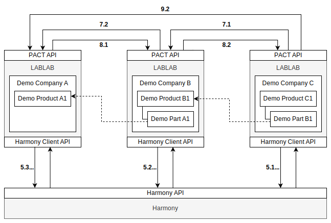


## 2. Download Source Code

### 2.1 Clone Harmony Repository

Run the following command to clone the Harmony repository to your local machine.

```sh
git clone git@github.com:mill6-plat6aux/harmony.git
```

### 2.2 Clone LABLAB Repository

Run the following command to clone the LABLAB repository to your local machine.

LABLAB is the Harmony-enabled branch of the [Ovule](https://github.com/mill6-plat6aux/ovule) project, so you'll need to do `git checkout`.

```sh
git clone git@github.com:mill6-plat6aux/ovule.git
git checkout lablab
```


## 3. Launch Containers

### 3.1. Create Docker Network

First, create a Docker network to allow Docker containers to communicate over a single network.

```sh
docker network create harmony_network
```

### 3.2. Launch Harmony

Go to the Harmony root directory and run the following command:

```sh
docker compose up
```

### 3.3. Launch LABLABs

Go to the root directory of LABLAB and execute the following command. 
This will start three LABLAB containers.

```sh
docker compose up
```


## 4. Setup Data

### 4.1. Setup Demo Company A

You can access Demo Company A's LABLAB by accessing the following URL in a web browser.

```
http://localhost:3002/client/
```

Demo Company A's account information is listed in `/lablab/database/demo1/users.sql`, so enter it to sign in.

#### 4.1.1. Register Data Source of Harmony

Register the Harmony endpoint on the Data Source screen. Refer to `/harmony/database/demo.sql` for authentication information.

|Endpoint|URL|
|--|--|
|Authenticate|http://harmony-web/auth/token|
|Events|http://harmony-web/events|
|Data Source Update|http://harmony-web/datasources|

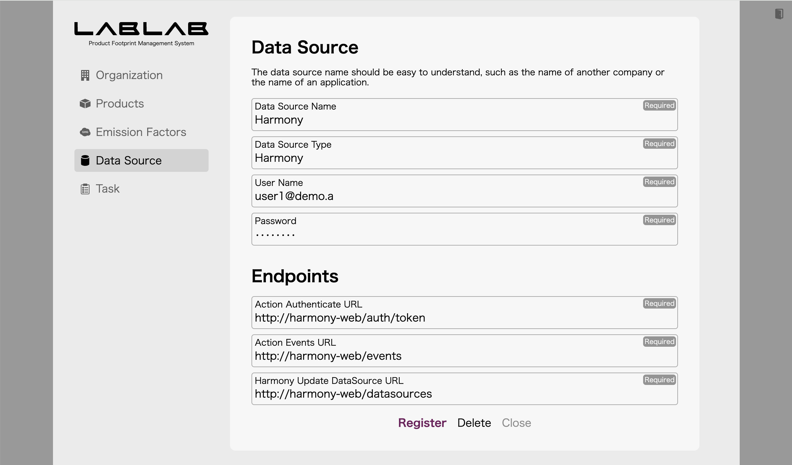

#### 4.1.2. Register Company Identifier for Demo Company A

Register the company identifier `40d0eaa7-d9eb-4eab-ad56-dd4fddd725e6` on the Organization screen.

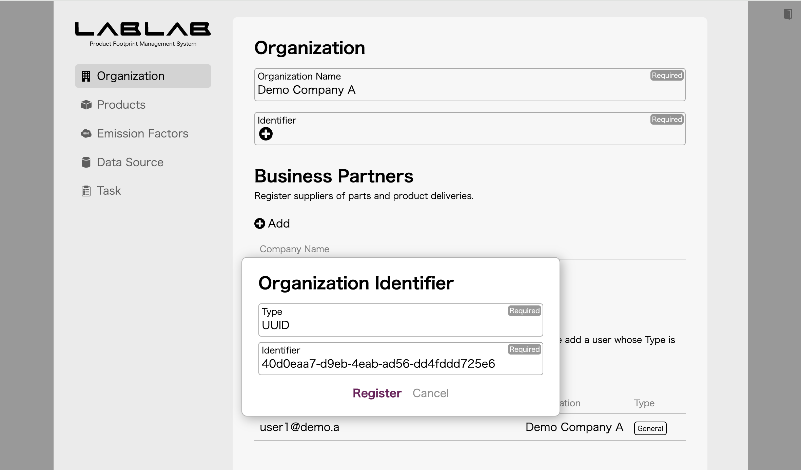

#### 4.1.3. Register User for Harmony

On the Organization screen, register a user who will be accessed by Harmony via the Harmony Client API. Enter any appropriate string for the username and password.

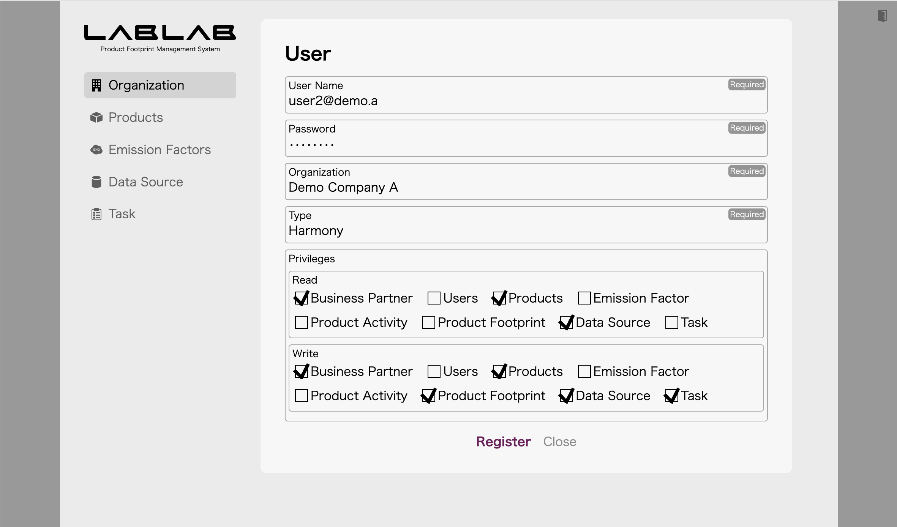

### 4.2. Setup Demo Company B

You can access Demo Company B's LABLAB by accessing the following URL in a web browser.

```
http://localhost:3004/client/
```

Demo Company B's account information is listed in `/lablab/database/demo2/users.sql`, so enter it to sign in.

#### 4.2.1. Register Data Source of Harmony

Register the Harmony endpoint on the Data Source screen. Refer to `/harmony/database/demo.sql` for authentication information.

#### 4.2.2. Register Company Identifier for Demo Company B

Register the company identifier `61038ceb-15c9-43f7-a9bd-97a3ad2e34b5` on the Organization screen.

#### 4.2.3. Register User for Harmony

On the Organization screen, register a user who will be accessed by Harmony via the Harmony Client API. Enter any appropriate string for the username and password.

### 4.3. Setup Demo Company C

You can access Demo Company C's LABLAB by accessing the following URL in a web browser.

```
http://localhost:3006/client/
```

Demo Company C's account information is listed in `/lablab/database/demo3/users.sql`, so enter it to sign in.

#### 4.3.1. Register Data Source of Harmony

Register the Harmony endpoint on the Data Source screen. Refer to `/harmony/database/demo.sql` for authentication information.

#### 4.3.2. Register Company Identifier for Demo Company C

Register the company identifier `e22fedcc-c3d7-4481-8f44-9d0ee0aa3d40` on the Organization screen.

#### 4.3.3. Register User for Harmony

On the Organization screen, register a user who will be accessed by Harmony via the Harmony Client API. Enter any appropriate string for the username and password.


## 5. Request Other Company Data Source

### 5.1. Data source request from Demo Company C to Demo Company B

Sign in to LABLAB of Demo Company C, click **Request** on the Data Source screen, and make a data source request. The company identifier is `61038ceb-15c9-43f7-a9bd-97a3ad2e34b5`.

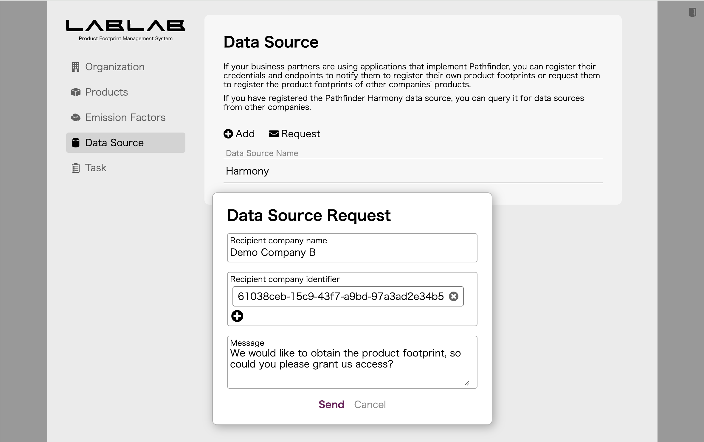

### 5.2. Data source request from Demo Company B to Demo Company A

Sign in to LABLAB of Demo Company B, click **Request** on the Data Source screen, and make a data source request. The company identifier is `40d0eaa7-d9eb-4eab-ad56-dd4fddd725e6`.

### 5.3. Data source reply from Demo Company A to Demo Company B

Sign in to LABLAB of Demo Company A, you can see the request from Demo Company B on the Task screen. To fulfill this request, go to the Organization screen and click **Add** in the User field to register a user for Demo Company B. Set the type to **Pathfinder**.

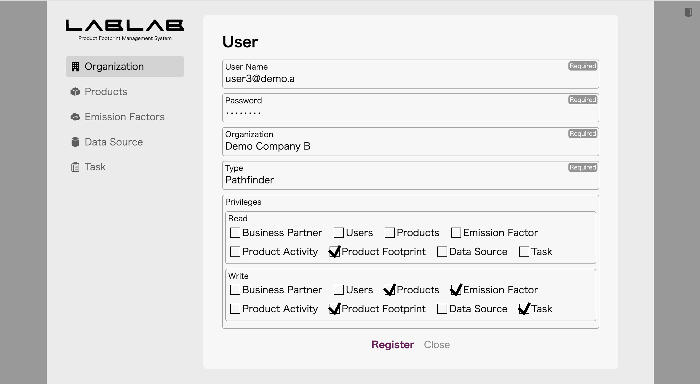

Next, click on Demo Company B's request on the Task screen and change the status to **Completed**, and a dialog box will appear where you can enter your response. This is where you enter the user account you created earlier.

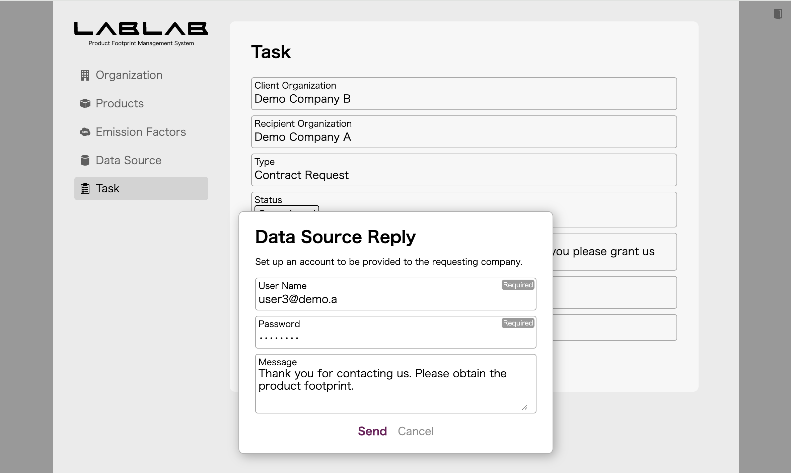

### 5.4. Data source reply from Demo Company B to Demo Company C

Sign in to LABLAB of Demo Company B, you can see the request from Demo Company C on the Task screen. To fulfill this request, go to the Organization screen and click **Add** in the User field to register a user for Demo Company C. Set the type to **Pathfinder**.

Next, click on Demo Company C's request on the Task screen and change the status to **Completed**, and a dialog box will appear where you can enter your response. This is where you enter the user account you created earlier.

When communicating with Action Events, you need data sources in both directions.

### 5.5. Data source request from Demo Company A to Demo Company B

Sign in to LABLAB of Demo Company A, click **Request** on the Data Source screen, and make a data source request. The company identifier is `61038ceb-15c9-43f7-a9bd-97a3ad2e34b5`.

### 5.6. Data source request from Demo Company B to Demo Company C

Sign in to LABLAB of Demo Company B, click **Request** on the Data Source screen, and make a data source request. The company identifier is `e22fedcc-c3d7-4481-8f44-9d0ee0aa3d40`.

### 5.7. Data source reply from Demo Company C to Demo Company B

Sign in to LABLAB of Demo Company C, you can see the request from Demo Company C on the Task screen. To fulfill this request, go to the Organization screen and click **Add** in the User field to register a user for Demo Company B. Set the type to **Pathfinder**.

Next, click on Demo Company B's request on the Task screen and change the status to **Completed**, and a dialog box will appear where you can enter your response. This is where you enter the user account you created earlier.

### 5.8. Data source reply from Demo Company B to Demo Company A

Sign in to LABLAB of Demo Company B, you can see the request from Demo Company C on the Task screen. To fulfill this request, go to the Organization screen and click **Add** in the User field to register a user for Demo Company A. Set the type to **Pathfinder**.

Next, click on Demo Company A's request on the Task screen and change the status to **Completed**, and a dialog box will appear where you can enter your response. This is where you enter the user account you created earlier.

Now, the Demo Companies A, B, and C are ready to communicate using Action Events.


## 6. Register Products

### 6.1. Demo Company A Product Registration

Sign in to LABLAB of Demo Company A and register `Demo Product A1` on the Products screen. The product identifier should be `7fa99a0e-2761-4939-b9c8-89b18bf18074`.

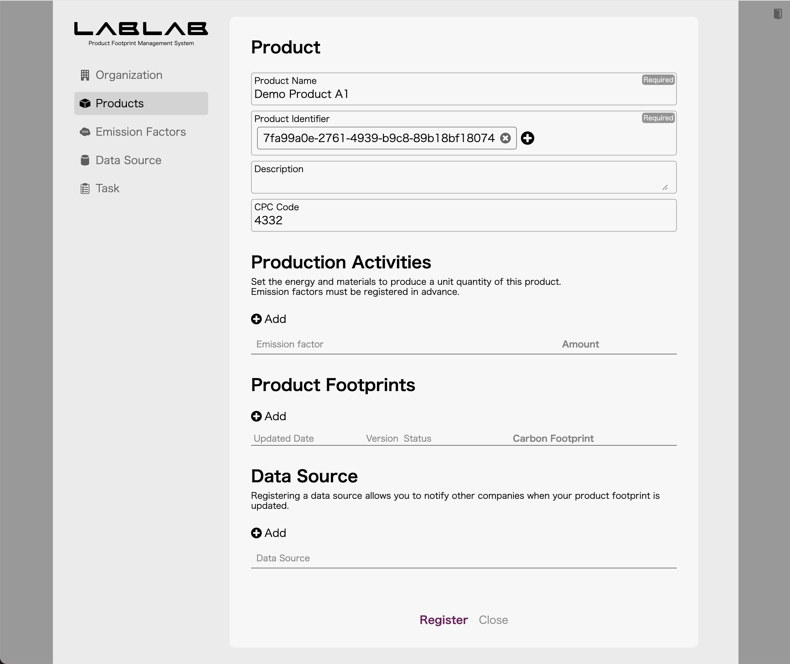

### 6.2. Demo Company B Product Registration

Sign in to LABLAB of Demo Company B and register `Demo Product B1` on the Products screen. The product identifier should be `cde7a435-5130-4f6a-afba-c6e71a405f3c`.

Next, click the icon on the left side of Demo Product B1 in the product list, then click **Add** to register a child element (part) with the name `Demo Part A1`. The supplier is Demo Company A and the product identifier should be `7fa99a0e-2761-4939-b9c8-89b18bf18074`.

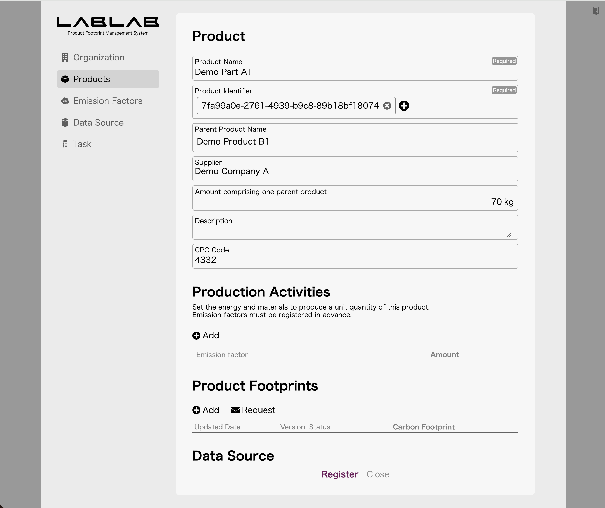

### 6.3. Demo Company C Product Registration

Sign in to LABLAB of Demo Company C and register `Demo Product C1` on the Products screen. The product identifier should be `bd79fe76-3aad-4f97-ac8a-05d9a19936be`.

Next, click the icon on the left side of Demo Product C1 in the product list, then click **Add** to register a child element (part) with the name `Demo Part B1`. The supplier is Demo Company B and the product identifier should be `cde7a435-5130-4f6a-afba-c6e71a405f3c`.


## 7. Request Product Footprint

### 7.1. Product footprint request from Demo Company C to Demo Company B

Sign in to LABLAB of Demo Company C and select Demo Part B1 on the Products screen. Next, click **Add** in the Data Source field and select the Demo Company B data source.

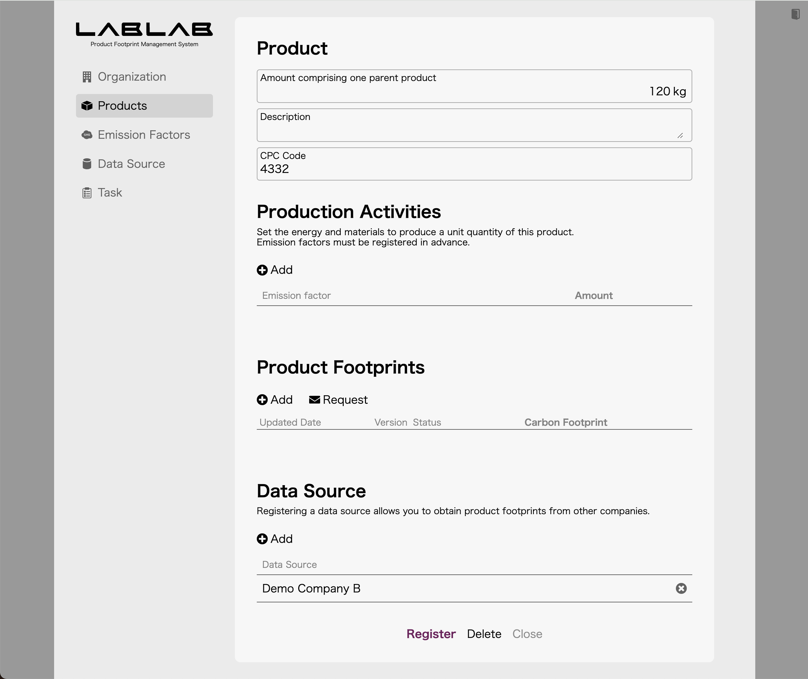

Next, click **Request** in the product footprint column and enter a message.

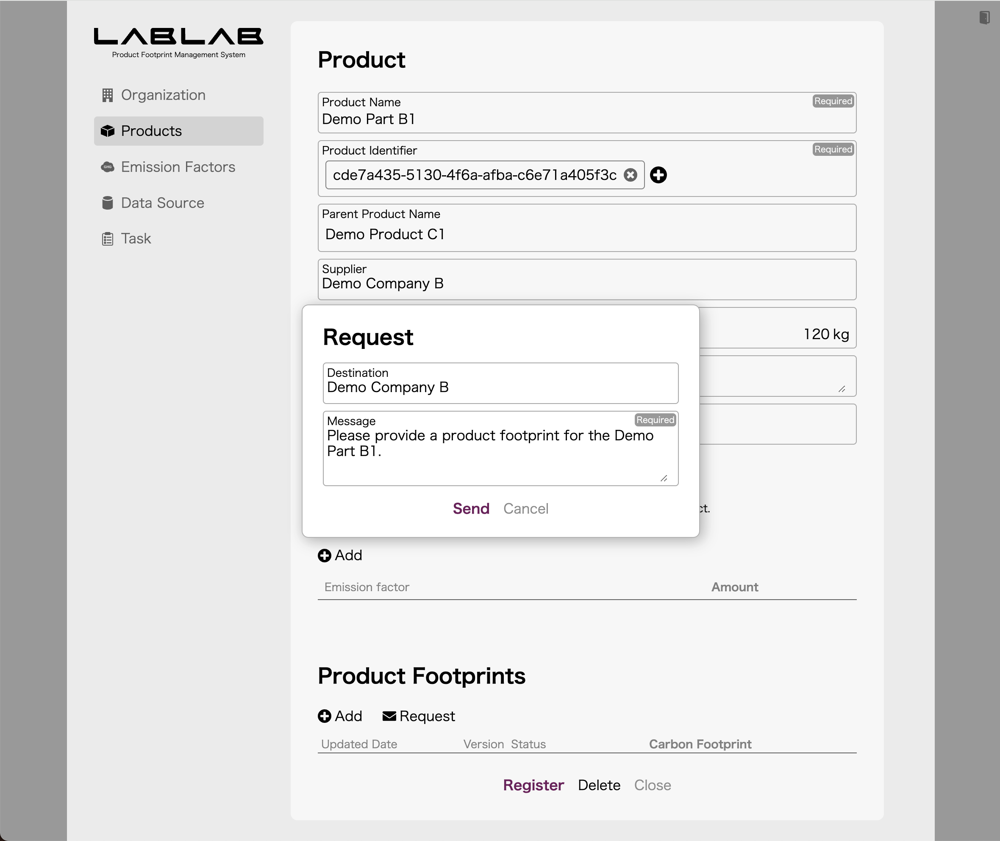

### 7.2. Product footprint request from Demo Company B to Demo Company A

Sign in to LABLAB of Demo Company B and select Demo Part A1 on the Products screen. Next, click **Add** in the Data Source field and select the Demo Company A data source.

Next, click **Request** in the product footprint field and enter a message.


## 8. Register Product Footprint

### 8.1. Demo Company A's Product Footprint Registration

Sign in to LABLAB of Demo Company A, select Demo Product A1 on the Products screen. Next, click **Add** in the Data Source field and select the Demo Company A data source.

Next, click **Add** in the Product Footprints field and enter appropriate values.

If there are no problems with the product footprint contents, Demo Company B's request is evaluated and the data is sent to Demo Company B's LABLAB. Once the transmission is complete, the request status is updated to **Completed**.

If you sign in to Demo Company B's LABLAB and display Demo Part A1 on Products screen, the data you just entered should be linked to the product footprint.

### 8.2. Demo Company B's Product Footprint Registration

Sign in to LABLAB of Demo Company B, select Demo Product B1 on the Products screen. Next, click **Add** in the Data Source field and select the Demo Company A data source.

Next, click **Add** in the Product Footprint field and enter appropriate values.

If there are no problems with the product footprint contents, Demo Company C's request is evaluated and the data is sent to Demo Company C's LABLAB. Once the transmission is complete, the request status is updated to **Completed**.

If you sign in to Demo Company C's LABLAB and display Demo Part B1 on Products screen, the data you just entered should be linked to the product footprint.


## 9. Traceability Information Request

### 9.1. Request for traceability information from Demo Company C to Demo Company A

Sign in with LABLAB of Demo Company C and display Demo Part B1, which is a child element of Demo Product C1, on the Products screen. 

The product footprint field should display the product footprint received from Demo Company B, clicking the icon on the left side of this data will display the upstream product footprint.

This data was registered by Demo Company A, but Demo Company C is not allowed to view it, so the contents are not displayed. When you click on the data, you will be asked whether you want to request to view the data, so click **Request**. The dialog will then be displayed, so enter a request message.

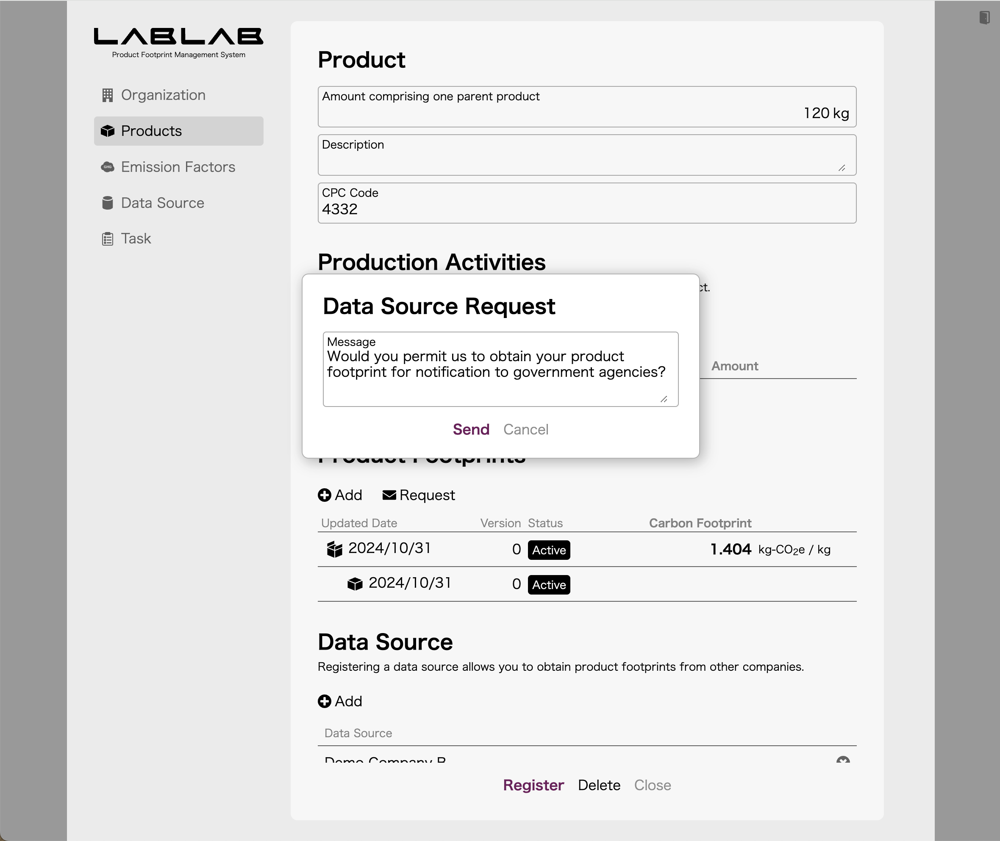

### 9.2. Data source reply from Demo Company A to Demo Company C

Sign in to LABLAB of Demo Company A and display the task screen to see the data source request from Demo Company C.

To respond to this request, click **Add** in the Users field on the Organization screen to create a user for Demo Company C.

Next, go to the Task screen, open the data source request for Demo Company C and update the status to **Completed**. The dialog will appear, so set the account for Demo Company C that you registered earlier.

After this, sign in to LABLAB of Demo Company C and display the child elements of the product footprint for Demo Part B1 again, and the data should be displayed.

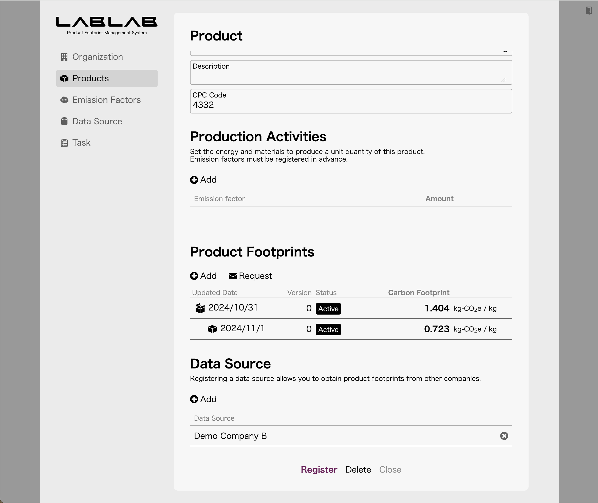

---

&copy; Takuro Okada