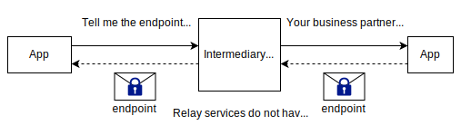
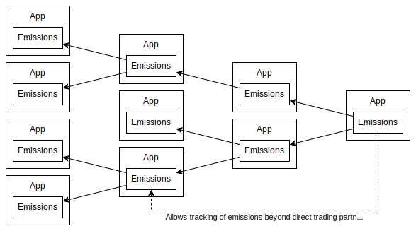
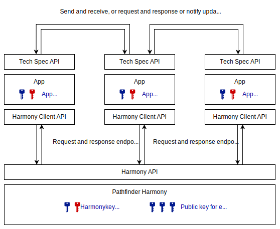
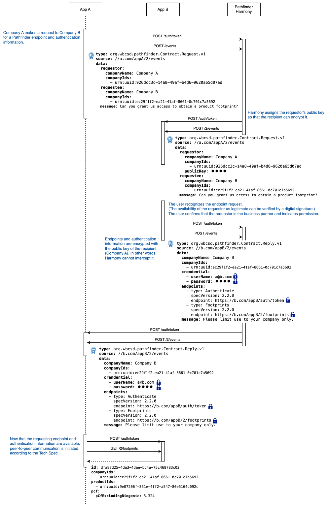
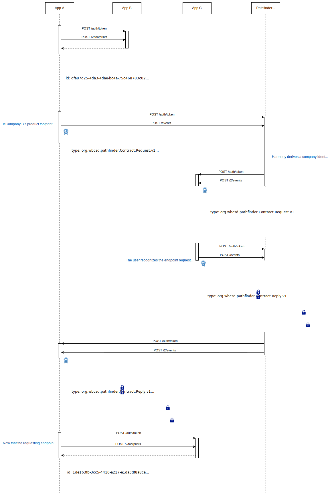

<div align="center">
    <div>
        <picture>
            <source media="(prefers-color-scheme: dark)" srcset="../../images/title-w.svg"/>
            
        </picture>
    </div>
    Intermediary Service for Pathfinder Applications
</div>

version 0.9.0

[EN](architecture.md)

**Table of Contents**

[TOC]

## 1. 課題

自社の温室効果ガス排出量を算出しステークホルダーへ公開する動きが世界規模で活発化してきている。[GHG Protocol](https://ghgprotocol.org)によればスコープ1（温室効果ガスの直接排出）、スコープ2（電気、熱/蒸気の生成に伴う間接排出）、スコープ3（スコープ2以外の間接排出）に分けて企業の温室効果ガスを算出する必要があるが、現在のところほとんどの企業はスコープ1やスコープ2の算出にとどまっているか、いわゆる「2次データ」の利用によって近似的にスコープ3の算定を行っている。この状況はつまるところスコープ3の算出が他社のスコープ1に当たることに起因している。すなわち得意先であろうと一般的には他社の排出量を詳細に知ることが難しいということである。そこで、[WBCSD/PACT](https://www.carbon-transparency.org)は、温室効果ガス排出量の把握のみに内容を限定することで、できるだけ企業機密に抵触しないデータモデルを定義するとともに、各企業が管理している温室効果ガスにアクセスするための手段をAPI（Application Programming Interface）として定義した、[Technical Specifications for PCF Data Exchange](https://wbcsd.github.io/tr/data-exchange-protocol/)（以下、Tech Spec）を公開した。これを利用すれば企業が算出した自社の排出量を得意先へ提供できるようになり、それによって各社のスコープ3の精緻化が図れるようになるという狙いである。

Tech SpecはいわゆるREST APIであり、これを実装したWebサーバによって企業の温室効果ガス排出量をインターネットを経由して提供することを想定している。企業にとってはこのようなシステムを構築することが最初の課題となるであろうが、近年では、企業の活動量から温室効果ガス排出量を計算し、その結果をデータベースに保存するWebアプリケーション（SaaS）も数多くローンチされている。さらにこれらの多くはTech Specを実装して自社の情報を他社に提供できるようになってきている（[PACT Conformant Solutions](https://www.carbon-transparency.org/network)を参照）。企業はこういったアプリケーションを利用することで、前述のスコープ3精緻化を実務として行うことが可能となってきている。

インターネットを経由して外部のアプリケーションに接続する場合、接続先を表現するエンドポイント（URL群）と認証情報（ユーザID、パスワードといったもの）が必要となる。例えばある製品が10個の部品から構成されているとし、部品それぞれが他社で製造されているとすれば、10個のエンドポイントと認証情報の組みが必要となる。これらは一般的にはアプリケーションのストレージに厳重に保存され、アクセスが発生するたびに読み取られては通信を確立するために利用される。

ここで、Tech Specを実装するアプリケーションが広く企業に導入されるようになってくると、まずシステム運用面での問題が発生してくるだろう。それは前述のエンドポイントと認証情報の管理の煩雑さに起因するものである。高度な工業製品ともなると部品点数は数万点を超えるようなものもあり、そのような製品を数万点も保有する企業も少なくない。すなわちおびただしい数のエンドポイントと認証情報の組みを管理する必要性が生じてくるのだ。これをエンドユーザに任せることはできないので、アプリケーションベンダーが担うことになるのだがその負荷は膨大になり、最終的にはアプリケーションの運用費に反映されてユーザ企業の負担となる。

さらに業務面での問題もある。温室効果ガス排出量が精緻化されてくると、その低減に向けた自社製品の改良の効果についても正確に計測することが可能となるだろう。ただし、一般的に把握できるのは自社の得意先（ティア1）の把握までで、それより上流になると単純には把握することはできない。排出量の改善の余地（ホットスポット）が自社製品や得意先から納入している部品や原材料にあればよいが、それより上流にあると成す術がなくなる。例えば工業製品のような複雑な構成を持つ製品になると、ホットスポットが得意先に無く、はるか上流の原材料の精錬過程にある可能性も考えられる。そのため次のステップとしては、ある製品の排出量の内訳を把握したくなるのである。また、欧州電池規則などでは製品の構成要素を原材料まで遡ってその出自を明らかにすることが要請されている。このように既に温室効果ガス排出量の精緻化に関してはTech Specがカバーする範囲を超えて要望が高度化されてきているのが現状である。


## 2. 解決

### 2.1. スケーラビリティの改良

あるWebアプリケーションが他のWebアプリケーションへTech Spec APIを介して接続する場合、少なくとも[Action Authenticate](https://wbcsd.github.io/tr/data-exchange-protocol/#api-action-auth)（認証）と[Action ListFootprints](https://wbcsd.github.io/tr/data-exchange-protocol/#api-action-list)/[GetFootprint](https://wbcsd.github.io/tr/data-exchange-protocol/#api-action-get)（製品フットプリント取得）のエンドポイント、さらにユーザIDとパスワードからなる認証情報が必要となる（Tech Spec ver2ではさらに[Action Events](https://wbcsd.github.io/tr/data-exchange-protocol/#api-action-events)のエンドポイントも必要）。これをエンドユーザが逐一把握しておくことは難しいので、一般的にはWebアプリケーションのストレージに厳重に保管しておくことになるだろう。

エンドユーザの実務としては、取引先とのデータ参照に関する契約があり、システム担当者による相互のアプリケーションに関する情報交換があり、お互いにアプリケーションの設定変更が行われた後に初めて情報の取得が可能となる。前述のとおり高度に複雑な製品では部品点数が数万点にもなるので、単純に考えればこのようなプロセスが数万回発生することになる。これはとても現実的な状況とは言い難いだろう。

そこで、アプリケーションとは別に中立的なWebサーバ（仲介サービス）を用意し、アプリケーションのエンドポイントと認証情報のやり取りを仲介するようにする。こうすることで、対象の企業識別子や製品識別子、製品フットプリントの識別子という限定的な情報から、データ保有者のアプリケーションを特定し、当事者間の同意の上でデータを流通させるまでのプロセス効率的に実現することができる。



ここで注意すべきは、エンドポイントや認証情報というソリューションベンダにとっては最も重要なデータを、仲介サービスに保存するわけではないということである（要するにアプリケーションの台帳を作ることが目的ではない）。これらがあくまでアプリケーション側で最大限度のセキュリティで守られなければならない点は変わらない。仲介サービスは、文字通りエンドポイントや認証情報が交わされて二つのアプリケーション間での通信（ピアツーピア通信）が確立するための手助けをするだけである。

もう一つの重要なポイントは、エンドポイントの要求者が本当にエンドユーザが認識している取引先であるのかというところである。送信元が簡単に偽装できるのであれば、この仕組みは全く意味をなさなくなるだろう。そこで要求者の正当性の証明として電子署名を用いる。電子署名に関してはすでに普遍的なものとなっており、ライブラリも多数公開されているためアプリケーション側の実装もそれほど負担にはならないと思われる。

### 2.2. トレーサビリティの実現

サプライチェーンを構成する企業がそれぞれTech Spec APIを実装したアプリケーションを利用し、それらが下流から上流まで連結したネットワークについて考える。トレーサビリティの実現とは、例えば最下流の企業が自社の製品について、その構成部品の仕入先にアクセス、さらにその構成部品の原材料の仕入れ先にアクセス、というように単純な企業間の取引を越えてサプライチェーンを遡り、製品を構成する要素全ての温室効果ガス排出量の内訳を明らかにすることである。



Tech Specのデータモデル（製品フットプリント）は自社製品の排出量のみを表現するに留めている。この狙いは表現できる範囲をあくまでデータの保有者の権利の範囲内に収めるためと思われるが、そのため製品フットプリント単体ではトレーサビリティを表現することはできない。

トレーサビリティを実現するための最も単純な拡張手段は、製品フットプリントを入れ子構造にすることである。しかし、入れ子にした製品フットプリントには他社の企業識別子や製品識別子が含まれており、これではデータ保有者の権利を逸脱することになるだろう。そこで製品フットプリント識別子のみを入れ子にするのである。こうすればデータ保有者の権利を超えてデータそのものにアクセスされることはない。ただし、データの保有者がデータの開示に同意した場合、中間の企業は自社の製品の組成がある程度明らかになってしまう点に注意が必要である。もう一つの方法は、企業識別子や製品識別子といった企業を特定する情報を排除し、排出量と製品カテゴリのみを入れ子にする方法である。こうすれば、機密情報を隠蔽しつつホットスポット分析のみに利用できる情報を提供することができる。ただし、部分的にデータ保有者の権限を逸脱することにもなってしまうため、あらかじめデータ保有者全ての了承を得ておく必要がある。

前述の通り、いずれの方法にも一長一短があり、また業態によっても利用できる形態は異なると思われる。そのため拡張手段としては、どのような形態も取りうるような汎用的なデータモデルを提案したい。

## 3. Pathfinder Harmony

我々は前述の仲介サービスを**Pathfinder Harmony**と名付け、開発を行った。以下ではこの実現方式について詳細に説明を行う。

### 3.1. システム構成



Pathfinder Harmonyは単純なREST APIサーバである。アプリケーションとPathfinder Harmonyはそれぞれに実装されたAPIを介して相互通信を行うが、Harmony側をHarmony API、アプリケーション側をHarmony Client APIと呼ぶ。

Pathfinder Harmonyのアカウントは製品フットプリントを保有する企業ごとに発行される。このとき、企業はまずキーペア（秘密鍵と公開鍵の一組）を生成し、公開鍵のみをPathfinder Harmonyへ登録する。これはアプリケーションとPathfinder Harmonyの通信において、送信者の正当性を保証するために電子署名を付与するためと、必要に応じてデータの一部を特定の相手のみが復号化できるようにするためである（すべての通信はTLSによって暗号化される想定だがPathfinder Harmonyをはじめ通信経路での傍受を不可能にするため）。キーペアの生成には現在のところ`openssl genrsa`と`openssl rsa`を利用すればよい。

#### 3.1.1. Harmony  API

Harmony APIは以下の構成からなる。

| Path         | Method | Contents                                                     |
| ------------ | ------ | ------------------------------------------------------------ |
| /datasources | POST   | アプリケーションのエンドポイント（Harmony Client API）と認証情報を登録する。 |
|              | DELETE | アプリケーションのエンドポイント（Harmony Client API）と認証情報を削除する。 |
| /events      | POST   | PathfinderのAction Eventsと同じくアプリケーションからCloudEvents形式でイベントを受け取る。イベントの種類については後述。 |

`/events`パスで設定できるタイプは以下のとおり。

| Event Type                                       | Contents                                                     |
| ------------------------------------------------ | ------------------------------------------------------------ |
| org.wbcsd.pathfinder.Company.Updated.v1          | 企業情報の登録/更新。データは企業名と識別子のみ。アカウント発行時点で企業情報は保存されているが、企業識別子が変更となった場合、企業の統廃合等により企業名が変わった場合などに利用する。 |
| org.wbcsd.pathfinder.ProductFootprint.Updated.v1 | 製品フットプリントの登録。データは製品フットプリント識別子のみ。後述のTraceability Extensionと絡めたトレーサビリティ情報へのアクセスにて利用される。 |
| org.wbcsd.pathfinder.Contract.Request.v1         | Tech Spec APIのエンドポイントと認証情報の要求。データは要求元企業と要求先企業の情報、要求先へのメッセージ。後述のTraceability Extensionと絡めたトレーサビリティ情報へのアクセスでは要求先を製品フットプリント（の保有者）として設定することもできる。 |
| org.wbcsd.pathfinder.Contract.Reply.v1           | Tech Spec APIのエンドポイントと認証情報の要求。データはエンドポイントと認証情報、要求元へのメッセージ。 |

まず、Harmony APIへのアクセスは全域において[OAuth2 Client Credentials Grant](https://www.rfc-editor.org/rfc/rfc6749#section-4.4)による認証が必要である。この認証形式はTech SpecのAction Authenticateと同じであり、アプリケーションベンダーにとっては平易に実装できる形態であろう。

続いてアプリケーションは、Pathfinder Harmonyと双方向の通信が行えるようにHarmony Client APIのエンドポイントと認証情報を登録する（`/datasources`パス）。このAPIは、Pathfinder Harmonyを介して他社からのデータを受信するときに必要となるものであり、アプリケーション側で実装する必要があるものである（後述）。特に、認証情報はTech SpecにおけるAction Authenticateの認証情報ではなく、あくまでPathfinder Harmonyがアプリケーションへアクセするための認証情報であることに注意が必要である。すなわち、Pathfinder Harmonyにリスクが生じればこの認証情報を無効化すればよいが、その状態であってもTech Specによるピアツーピア通信は継続できるということである。

ここまでが初期設定であり、他社の初期設定も完了していれば、いよいよ外部アプリケーションの発見が可能となる。外部アプリケーションへのエンドポイントと認証情報の要求は、Tech SpecのAction Eventsと同様のCloudEvents形式によるAPIの呼び出しによって行われる（`/events`パス）。

データ形式の詳細については[APIリファレンス](../api.html)を参照のこと。

#### 3.1.2. Harmony Client API

Harmony Client APIのパス構成は以下のとおりひとつだけである。アプリケーションの対応コストをできるだけ引き下げるため、Action Eventsと同じ形式をとった。既存のAction Eventsの実装を拡張してもよいだろう。ちなみにAction Eventsのパスは厳密には現在`/2/events`であるが、実運用においてはそれとおなじくバージョン番号を付与したものにしてよい。

| Path    | Method | Contents                                                     |
| ------- | ------ | ------------------------------------------------------------ |
| /events | POST   | PathfinderのAction Eventsと同じくCloudEvents形式でHarmonyからイベントを受け取る。イベントの種類については後述。 |

`/events`パスで設定できるタイプは以下のとおり。

| Event Type                               | Contents                                                     |
| ---------------------------------------- | ------------------------------------------------------------ |
| org.wbcsd.pathfinder.Contract.Request.v1 | Tech Spec APIのエンドポイントと認証情報の要求。データは要求元企業（他社）と要求先企業（自社）の情報、要求先へのメッセージ。 |
| org.wbcsd.pathfinder.Contract.Reply.v1   | Tech Spec APIのエンドポイントと認証情報の要求。データは他社のエンドポイントと認証情報、要求元へのメッセージ。 |

データ形式の詳細については[APIリファレンス](../client-api.html)を参照のこと。

#### 3.1.3. 電子署名

電子署名は[RFC9421](https://www.rfc-editor.org/rfc/rfc9421)に従って実現する。例えばエンドポイントと認証情報の要求を行う際には以下のようなHTTPヘッダを付与する。

```http
POST /events HTTP/1.1
Host: HOST_NAME
Authorization: Bearer ACCESS_TOKEN
Content-Type: application/cloudevents+json; charset=UTF-8
Content-Digest: sha-256=:CONTENT_DIGEST:
Signature-Input: sig1=("@method" "@authority" "@path" content-digest);created=DATETIME;alg="rsa-v1_5-sha256"
Signature: sig1=:SIGNATURE:
```

上記のうち、`HOST_NAME`はリクエスト先のホスト名、`ACCESS_TOKEN`はHarmonyの認証やアプリケーションの認証時に取得したアクセストークンである。
`Content-Digest`ヘッダはPOSTメソッドの場合のみ付与されるもので、`CONTENT_DIGEST`は、リクエストボディをSHA256でハッシュしBase64でエンコードした値となる。
`Signature-Input`ヘッダは`Signature`ヘッダに設定されるハッシュ値のソースとなった情報を指定する。基本的には以上のような情報が設定されていれば十分と考える。`DATETIME`は署名を行ったときのタイムスタンプ（UNIX時刻）である。
最後に`SIGNATURE`は電子署名として用いられる情報で、例えば以下のような文字列をSHA256でハッシュし、RSASSA-PKCS1-v1_5で電子署名を作成し、Base64でエンコードした値となる。

```
"@method": POST
"@authority": HOST_NAME
"@path": /events
content-digest: sha-256=:CONTENT_DIGEST:
```

`HOST_NAME`や`CONTENT_DIGEST`は前述のとおりである。

なお、電子署名アルゴリズムにより強固なEdDSAを利用してもよいが、その場合は`Signature-Input`ヘッダの`alg`パラメータにRFC9421でサポートされる署名アルゴリズムを指定すること。ただし、EdDSAにしろ量子コンピュータに対する耐性は極めて低いと思われるので、将来的には耐量子計算機暗号を用いた署名アルゴリズムが必要となるだろう。

### 3.2. アプリケーション発見フロー

以下にアプリケーションがPathfinder Harmonyを介して外部のアプリケーションを発見（エンドポイントと認証情報を取得）するためのフローを解説する。



アプリケーションApp AとApp Bがあり、それぞれCompany AとCompany Bが利用しているものとする。この2社は直接の取引関係にあるが、お互いのアプリケーションのエンドポイントと認証情報を知り得ていないとする。従来であれば、システム担当者間の打ち合わせがあり、お互いのエンドポイントと認証情報をやり取りするところを、Pathfinder Harmonyを介して最小限度の当事者間の対応により実現する。

まずCompany AのユーザはApp Aを介してPathfinder HarmonyにCompany Bのエンドポイントと認証情報を要求する。Pathfinder Harmonyは送信元と宛先の企業がすでに登録されていることを確認したのち、Company Aの公開鍵を要求に付与してCompany Bが利用するAppBへ中継する。

App Bでは、エンドポイントと認証情報の要求があったことをCompany Bのユーザに伝える。ユーザは要求に含まれる送信元情報を参照し、それが取引先のCompany Aであることを確認する。Pathfinder Harmonyを介したデータの送受信電文には電子署名が付与されているので、送信元（Pathfinder Harmony）の公開鍵を利用してそれが正当なものであるかを検証できる。Company BのユーザはApp Bを介してこの要求を認め、Company A用のApp BのユーザアカウントとTech Specエンドポイントを応答する（アプリケーションによっては事前にユーザを作成するなどの操作が必要となるだろう）。Pathfinder Harmonyは、この応答が先ほど受領したCompany Aの要求に関連するものであることを認識し、Company Aが利用するApp Aへ中継する。

App Aはエンドポイントと認証情報を受領した旨をCompany Aへ伝え、これによってApp AからApp Bへの製品フットプリントの通信経路が確立する。この後の処理はTech Specに記載の通りのピアツーピアによる通信が行われる。なお、Tech Specには電子署名の付与については言及されていないのだが、これらの処理が実現できるアプリケーションであれば既存のAction ListFootprintsやAction GetFootprintへ電子署名を付与することも容易であると思われる。

## 4. Traceability Extension

製品のトレーサビリティに関する情報はTech Specのデータモデル拡張（`extensions`プロパティ）によって表現する。データモデル拡張の形式は[Technical Specification for Data Model Extensions](https://wbcsd.github.io/data-model-extensions/spec/)に記載されており、Traceability Extensionもこれに従って定義される。

### 4.1. データ構成

以下に製品フットプリントに`extensions`プロパティを付与するための形式を示す。これはTech Specにおける標準的なデータモデル拡張の形式である。

<table>
  <thead>
    <tr><td colspan="2"><b>Property Name</b></td><td><b>Type</b></td><td><b>Contents</b></td></tr>
  </thead>
  <tbody>
    <tr><td colspan="2">extensions</td><td>Array&lt;Object&gt;</td><td>データモデル拡張。配列の一要素としてTraceability Extensionを定義する。</td></tr>
    <tr><td></td><td>specVersion</td><td>String</td><td>データモデル拡張のバージョン。現行バージョンは<code>2.0.0</code></td></tr>
    <tr><td></td><td>dataSchema</td><td>String</td><td>データモデル拡張のデータ構造を表現するJSONスキーマ。<br/>Traceability Extensionの現行バージョンは<code>https://mill6-plat6aux.github.io/traceability-extension/schema.json</code>を指定する。</td></tr>
    <tr><td></td><td>data</td><td>Object</td><td>上記JSONスキーマに従ったデータ。<br/>Traceability Extensionのデータサンプルについては後述。</td></tr>
  </tbody>
</table>

製品のトレーサビリティとは、製品の組成を分解できる最小の粒度まで遡って表現することである。製品フットプリントにおいては、カーボンフットプリントの内訳を製品の部品構成や原材料に従って明らかにすることである。そのため、単純にはTech Specで定義される製品フットプリントを入れ子構造にすればよい。ただし、製品の部品や原材料が他社から供給されるのであれば、データ所有者の権利を超えてデータを表現することにもなり、Tech Specの理念からも逸れることになるだろう。そこで、製品フットプリントの一部をそのまま利用しつつも全てのプロパティを選択可と定義し、取引先の許可する範囲でデータを表現できるようにした。このJSONオブジェクトを`ProductFootprintFragment`とする。

<table>
  <thead>
    <tr><td colspan=3><b>Property Name</b></td><td><b>Type</b></td><td><b>Required</b></td></tr>
  </thead>
  <tbody>
    <tr><td colspan=3><b>id</b></td><td>String&lt;uuid&gt;</td><td>Optional</td></tr>
    <tr><td colspan=3><b>created</b></td><td>String&lt;date-time&gt;</td><td>Optional</td></tr>
    <tr><td colspan=3><b>updated</b></td><td>String&lt;date-time&gt;</td><td>Optional</td></tr>
    <tr><td colspan=3><b>validityPeriodStart</b></td><td>String&lt;date-time&gt;</td><td>Optional</td></tr>
    <tr><td colspan=3><b>validityPeriodEnd</b></td><td>String&lt;date-time&gt;</td><td>Optional</td></tr>
    <tr><td colspan=3><b>companyName</b></td><td>String</td><td>Optional</td></tr>
    <tr><td colspan=3><b>companyIds</b></td><td>Array&lt;String&gt;</td><td>Optional</td></tr>
    <tr><td colspan=3><b>productDescription</b></td><td>String</td><td>Optional</td></tr>
    <tr><td colspan=3><b>productIds</b></td><td>Array&lt;String&gt;</td><td>Optional</td></tr>
    <tr><td colspan=3><b>productCategoryCpc</b></td><td>String</td><td>Optional</td></tr>
    <tr><td colspan=3><b>productNameCompany</b></td><td>String</td><td>Optional</td></tr>
    <tr><td colspan=3><b>pcf</b></td><td>Object</td><td>Optional</td></tr>
    <tr><td></td><td colspan=2><b>declaredUnit</b></td><td>String</td><td>Optional</td></tr>
    <tr><td></td><td colspan=2><b>pCfExcludingBiogenic</b></td><td>String</td><td>Optional</td></tr>
    <tr><td></td><td colspan=2><b>pCfIncludingBiogenic</b></td><td>String</td><td>Optional</td></tr>
    <tr><td></td><td colspan=2><b>referencePeriodStart</b></td><td>String&lt;date-time&gt;</td><td>Optional</td></tr>
    <tr><td></td><td colspan=2><b>referencePeriodEnd</b></td><td>String&lt;date-time&gt;</td><td>Optional</td></tr>
    <tr><td></td><td colspan=2><b>primaryDataShare</b></td><td>Number</td><td>Optional</td></tr>
    <tr><td></td><td colspan=2><b>dqi</b></td><td>String&lt;date-time&gt;</td><td>Optional</td></tr>
    <tr><td></td><td></td><td><b>coveragePercent</b></td><td>Number</td><td>Optional</td></tr>
    <tr><td></td><td></td><td><b>technologicalDQR</b></td><td>Number</td><td>Optional</td></tr>
    <tr><td></td><td></td><td><b>temporalDQR</b></td><td>Number</td><td>Optional</td></tr>
    <tr><td></td><td></td><td><b>geographicalDQR</b></td><td>Number</td><td>Optional</td></tr>
    <tr><td></td><td></td><td><b>completenessDQR</b></td><td>Number</td><td>Optional</td></tr>
    <tr><td></td><td></td><td><b>reliabilityDQR</b></td><td>Number</td><td>Optional</td></tr>
    <tr><td colspan=3><b>breakdownPfs</b></td><td>Array&lt;ProductFootprintFragment&gt;</td><td>Optional</td></tr>
  </tbody>
</table>
`ProductFootprintFragment`は、基本的に、既存のTech Specの`ProductFooptrint`データモデルからトレーサビリティに関係するであろうプロパティを選別し、全プロパティをオプショナル（必要に応じて特定のプロパティのみを含めることができる）にしたものである。

ひとつだけ追加したプロパティとしては`breakdownPfs`プロパティがある。これは`ProductFootprintFragment`自体の入れ子を表現する。まずは、拡張元の`ProductFooptrint`の内訳を表現するため、データモデル拡張のルート要素は`breakdownPfs`のみとなる。その要素として`ProductFootprintFragment`の配列を定義していくが、これが`ProductFooptrint`の内訳そのものである。さらに`ProductFootprintFragment`の内訳を表現したいのであれば、それに`breakdownPfs`を付与すればよい。こうして、無段階のトレーサビリティを表現することができる。

このデータモデルの利用方法は実務上2つのパターンに分けられると思われる。

### 4.2. 製品フットプリントIDのみの連携

ひとつは、取引先の上流企業が自社企業を超えてさらなる下流企業へデータを提供してよいか不明である場合である。この場合は製品フットプリント識別子（`id`プロパティ）のみを定義して、表現を最小限度に留めるのである。こうすることで、データ取得の最小限のデータは提供するが、その取得においてはデータ保有者の許可に完全に委ねることができる。データの取得手段についてはPathfinder Harmonyによって提供することができる（後述）。

以下の例では、製品フットプリント`9341862a-a73f-4bdf-9a33-2988893a6fdf`の内訳として、三つの製品フットプリント`cf3d2360-6c87-4363-ae94-0dd3fb591e30`、`21169df7-f2f4-4d88-9daa-5b62af94cf83`、`72cd141f-63d0-4d5c-bb3c-7767b9ba46e0`が指定されている。カーボンフットプリントの集計値は`0.139 kg-CO2e/kg`だが、この算出にスコープ3排出量として3つの原単位を参照していることを示しているということである。

```json
{
  "id": "9341862a-a73f-4bdf-9a33-2988893a6fdf",
  ...
  "pcf": {
    "declaredUnit": "kilogram",
    "unitaryProductAmount": "100"
    "pCfExcludingBiogenic": "0.139",
    ...
  },
  "extension": [
    {
      "specVersion": "2.0.0",
      "dataSchema": "https://mill6-plat6aux.github.io/traceability-extension/schema.json",
      "data": {
        "breakdownPfs": [
          {
            "id": "cf3d2360-6c87-4363-ae94-0dd3fb591e30"
          },
          {
            "id": "21169df7-f2f4-4d88-9daa-5b62af94cf83"
          },
          {
            "id": "72cd141f-63d0-4d5c-bb3c-7767b9ba46e0"
          }
        ]
      }
    }
  ]
}
```

しかしこの方法では、仮に上流企業が下流企業が要求に応じ、アプリケーションのエンドポイントと認証情報を提供した場合、中流の企業としては製品の組成がある程度明らかになってしまう可能性があることに注意が必要である。

### 4.3. 排出量のみの連携

トレーサビリティを提出する必要はあるが、前述の製品組成を下流企業へ完全に隠蔽したい場合は、もう一つの方法である排出量のみの連携を行う。この場合は製品フットプリントを提供せず、カーボンフットプリントの集計値（`pCfExcludingBiogenic`プロパティや`pCfIncludingBiogenic`プロパティ）を提供する。また、Tech Specのカーボンフットプリントは原単位であるので母数である数量単位（`declaredUnit`プロパティ）も指定する必要がある。ただし、カーボンフットプリントのみでは、下流側で分析できる有用な情報とはならないであろう（例えばティア3でホットスポットが見つかったとしてもそれがなんであるかがわからず実際に起こせるアクションがない）。であるから、製品カテゴリを表す情報（`productCategoryCpc`プロパティ）を付与しておいたほうがよいであろう。

以下の例では、製品フットプリント`9341862a-a73f-4bdf-9a33-2988893a6fdf`の内訳として、三つの`ProductFootprintFragment`が定義されているが、いずれも製品フットプリント識別子をはじめ企業IDや製品IDも隠蔽しており、製品カテゴリとカーボンフットプリントのみが表現されている。こうすることで上流の企業は取引先を明らかにすることなくカーボンフットプリントの内訳を表現することができる。さらに、一つ目の`ProductFootprintFragment`は子要素に`breakdownPfs`をもっており、そのさらなる内訳を表現している。このようにして最上流の企業までカーボンフットプリントを明らかにしていけばトレーサビリティを表現することができるだろう。

```json
{
  "id": "9341862a-a73f-4bdf-9a33-2988893a6fdf",
  ...
  "pcf": {
    "declaredUnit": "kilogram",
    "unitaryProductAmount": "100"
    "pCfExcludingBiogenic": "0.139",
    ...
  },
  "extensions": [
    {
      "specVersion": "2.0.0",
      "dataSchema": "https://mill6-plat6aux.github.io/traceability-extension/schema.json",
      "data": {
        "breakdownPfs": [
          {
            "productCategoryCpc": "43112",
            "pcf": {
              "declaredUnit": "kilogram",
              "pCfExcludingBiogenic": "0.045"
            },
            "breakdownPfs": [
              {
                "productCategoryCpc": "43131",
                "pcf": {
                  "declaredUnit": "kilogram",
                  "pCfExcludingBiogenic": "0.005"
                },
              }
            ]
          },
          {
            "productCategoryCpc": "43133",
            "pcf": {
              "declaredUnit": "kilogram",
              "pCfExcludingBiogenic": "0.012"
            }
          },
          {
            "productCategoryCpc": "43122",
            "pcf": {
              "declaredUnit": "kilogram",
              "pCfExcludingBiogenic": "0.073"
            }
          }
        ]
      }
    }
  ]
}
```

ただし、このケースではデータ保有者の権限を局所的にではあるが逸脱していると言えるので、事前に上流企業に下流企業へのデータの一部公開に関する了承を得ておく必要があるだろう。将来的にはPathfinder Harmonyでこのあたりの業務サポートも行えるようにする。

### 4.4. Pathfinder Harmonyとの連携によるデータ取得フロー

[4.2. 製品フットプリントIDのみの連携](#42-製品フットプリントidのみの連携)において、上流企業から製品フットプリント識別子のみが指定された場合、その情報からどのようにしてデータ保有企業とその利用アプリケーションを特定するのかという問題が発生する。ここでPathfinder Harmonyに各アプリケーションが製品フットプリント生成のたびにその識別子のみを連携しておけば、製品フットプリントがリクエストされた場合にそれに関連する企業とアプリケーションを解決することができる。ただし、当然ながら、データにアクセスさせるかどうかはデータ保有者が決定すべきなので、Harmonyは単純にその要求のみを中継するにとどめる。



アプリケーションApp A、App B、App Cがあり、それぞれCompany A、Company B、Company Cが利用しているものとする。この3社の製品はCompany Aの製品を最下流、Company Cの製品を最上流とする部品構造を成しており、それに従ってサプライチェーンが構築されているものとする。また、Company AはCompany Bから部品を仕入れており、Company BはCompany Cから部品を仕入れているので、お互いを認識しているが、Company AはCompany Cのことを認識していないとする。

[3.2. アプリケーション発見フロー](#32-アプリケーション発見フロー)の例のように、App AはApp Bにエンドポイントと認証情報をリクエストし、既にそれらを受領しているものとする。そして、App AからApp BへList Footprintsが呼び出された時に、製品フットプリントにTraceability Extensionが含まれていたとする。

製品フットプリントの内訳には、部品の製品フットプリント識別子`1de1b3fb-3cc5-4410-a217-e1da3df8a8ca`が示されていたが、App Aはこれを識別できなかったため、Pathfinder Harmonyへ問い合わせを行う。このとき、問い合わせはCompany Aの取引先のさらに上流企業へ伝播されていくので、要求理由を表現するためのメッセージも重要となるであろう。

Pathfinder Harmonyはエンドポイントと認証情報の要求を受け付けるが、要求先として製品フットプリント識別子が設定されているため、その識別子が過去に登録されているかを調べる。対象の製品フットプリント識別子が見つかれば、そのデータを登録した企業を特定して、その企業へ要求を中継する。

以降の処理は[3.2. アプリケーション発見フロー](#32-アプリケーション発見フロー)の例と同様である。Company CがCompany Aからの要求を認識し、それに応答してエンドポイントと認証情報を送信すれば、App AからApp Bに加えてApp Cへも通信経路が確立するということだ。こうしてCompany Bから受け取った製品フットプリントの内訳にCompany Cから受け取る製品フットプリントが含まれていることを把握することが可能となった。

## 5. Developers

[Takuro Okada](mailto:mill6.plat6aux@gmail.com)